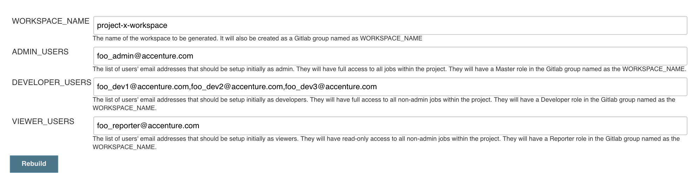

# Table of Contents

* [Overview](#overview)
* [What is Gitlab Platform Management?](#what-is-gitlab-platform-management)
* [Workspaces and Projects](#workspaces-and-projects)
    * [What does Generate_Workspace do?](#generate-workspace)
        * [OpenLDAP](#generate-workspace-for-openldap)
        * [Jenkins](#generate-workspace-for-jenkins)
        * [Gitlab](#generate-workspace-for-gitlab)
    * [What does Generate_Project do?](#generate-project)
        * [OpenLDAP](#generate-project-for-openldap)
        * [Jenkins](#generate-project-for-jenkins)
        * [Gitlab](#generate-project-for-gitlab)
* [Load Cartridge](#load-cartridge)

----

# Overview

This is the [Accenture Platform Management](https://github.com/Accenture/adop-platform-management) for Gitlab. 

To use this platform, you must use [pdcbuckets/adop-jenkins-gitlab-integration](https://github.com/pdcbuckets/adop-jenkins-gitlab-integration) project's Jenkins docker image which contains the required Jenkins system groovy scripts and Jenkins plugins. 

----

# What is Gitlab Platform Management?

The platform management repository includes the Jenkins jobs and supporting scripts that facilitate:

- Cartridges
- Multi-tenancy via workspaces & projects

This repository is loaded into the platform using the custom `GitLab_Load_Platform` job from [pdcbuckets/adop-jenkins-gitlab-integration](https://github.com/pdcbuckets/adop-jenkins-gitlab-integration) and contains:  

- Jenkins Job DSL - defines the Jenkins jobs for workspaces, projects, and cartridges
- Jenkins Groovy scripts - for automating the configuration of Jenkins
- Shell Scripts - for automating command line actions, such as with Gitlab or LDAP

Upon Jenkins startup, there should be a `Gitlab_Load_Platform` job.  


## Loading the Platform

Click Build.  


## DSL and System Scripts

Upon running the job, it will do the following:  

- It creates `Workspace_Management/Generate_Workspace` job
- It gets the `$GITLAB_ADMIN_USER` Gitlab api token. This should be the root user by default.
- It gets the `$INITIAL_ADMIN_USER` SonarQube api token.
- It creates a Gitlab API token credentials for the API Token which is used for Gitlab connection configuration.
- It creates a Gitlab Secret credentials for the API Token which is used for Credentials Binding in jobs.
- It creates a SonarQube Secret credentials for the API Token which is used for Credentials Binding in jobs.
- It creates an Administrator credentials using `$INITIAL_ADMIN_USER` and `$INITIAL_ADMIN_PASSWORD`

```
Processing DSL script Generate_Workspace.groovy
Added items:
    GeneratedJob{name='/Workspace_Management'}
    GeneratedJob{name='/Workspace_Management/Generate_Workspace'}
Found existing credentials: ADOP Gitlab Integration token
ADOP Gitlab Integration token is removed and will be recreated..
--> Registering Gitlab API token..
ADOP Gitlab Integration token created..
Found existing credentials: ADOP Gitlab Integration token - Secret Text
ADOP Gitlab Integration token - Secret Text is removed and will be recreated..
--> Registering Gitlab API token as Secret text..
ADOP Gitlab Integration token - Secret Text created..
Found existing credentials: ADOP Administrator Credentials
ADOP Administrator Credentials is removed and will be recreated..
--> Registering ADOP Administrator Credentials..
ADOP Administrator Credentials created..
--> Adding SonarQube installation ADOP Sonar 5_3_or_HIGHER
```

----

# Workspaces and Projects

Workspaces and Projects is a way to provide multitenancy across the Platform. 


## Generate Workspace

After running the `Gitlab_Load_Platform` job, go to `Workspace_Management` -> `Generate_Workspace`.  

See the example parameters in this image.  



## What does it do?

### Generate Workspace User Creation Note   

- If any of the parameter `*_USERS` is left empty, Jenkins will not create a user for that role.
- The initial password of the user is their username without the email.
- If users already exists in the specified role they will not be recreated.

### Generate Workspace for OpenLDAP  

- It creates the following Groups under `ou=groups`.
    - ou=groups,cn=`$WORKSPACE_NAME`.admin
    - ou=groups,cn=`$WORKSPACE_NAME`.developer
    - ou=groups,cn=`$WORKSPACE_NAME`.viewer

- It creates `$ADMIN_USERS`, `$DEVELOPER_USERS`, and `$VIEWER_USERS` and then are added to their respective groups.  

### Generate Workspace for Jenkins  

- It creates a top level Folder named `$WORKSPACE_NAME`

- It creates the following roles for the Role Based Authentication Plugin  

    - `$WORKSPACE_NAME`.admin.Content and `$WORKSPACE_NAME`.admin.Folder
    - `$WORKSPACE_NAME`.developer.Content and `$WORKSPACE_NAME`.developer.Folder
    - `$WORKSPACE_NAME`.viewer.Content and `$WORKSPACE_NAME`.viewer.Folder  

    This can be seen in `$JENKINS_URL/role-strategy/manage-roles`  

- It creates a `$WORKSPACE_NAME/Project_Management/Generate_Project` job.  

    

### Generate Workspace for Gitlab  

- It creates a top level `$WORKSPACE_NAME` group

- It adds `$ADMIN_USERS`, `$DEVELOPER_USERS`, and `$VIEWER_USERS` in the created group

- `$ADMIN_USERS`, will have `Master` a role for all projects under this group

- `$DEVELOPER_USERS`, will have `Developer` a role for all projects under this group

- `$VIEWER_USERS`, will have `Reporter` a role for all projects under this group

    

- __NOTE__: There is no LDAP Group sync in Gitlab Community Edition

----

## Generate Project

After successfully running `Generate_Workspace` job, navigate to `$WORKSPACE_NAME/Project_Management/Generate_Project`.   

See the example parameters in this image.  


## What does it do?

### Generate Project User Creation Note   

- If any of the parameter `*_USERS` is left empty, Jenkins will not create a user for that role.
- The initial password of the user is their username without the email.
- If users already exists in the specified role they will not be recreated.

### Generate Project for OpenLDAP

- It creates the following Groups under `ou=groups`.

    - ou=groups,cn=`$WORKSPACE_NAME`.`$PROJECT_NAME`.admin
    - ou=groups,cn=`$WORKSPACE_NAME`.`$PROJECT_NAME`.developer
    - ou=groups,cn=`$WORKSPACE_NAME`.`$PROJECT_NAME`.viewer

- It creates `$ADMIN_USERS`, `$DEVELOPER_USERS`, and `$VIEWER_USERS` and then are added to their respective groups.  

### Generate Project for Jenkins  

- It creates a top level Folder named `$WORKSPACE_NAME/$PROJECT_NAME`
- It creates the following roles for the Role Based Authentication Plugin  
    - `$WORKSPACE_NAME`.`$PROJECT_NAME`.admin.Content and `$WORKSPACE_NAME`.`$PROJECT_NAME`.admin.Folder
    - `$WORKSPACE_NAME`.`$PROJECT_NAME`.developer.Content and `$WORKSPACE_NAME`.`$PROJECT_NAME`.developer.Folder
    - `$WORKSPACE_NAME`.`$PROJECT_NAME`.viewer.Content and `$WORKSPACE_NAME`.`$PROJECT_NAME`.viewer.Folder  

    This can be seen in $JENKINS_URL/role-strategy/manage-roles  

- It creates a `$WORKSPACE_NAME/Project_Management/Generate_Project` job.  


### Generate Project for Gitlab  

- It creates a subgroup `$PROJECT_NAME` under `$WORKSPACE_NAME`

- It adds `$ADMIN_USERS`, `$DEVELOPER_USERS`, and `$VIEWER_USERS` in the created subgroup

- `$ADMIN_USERS`, will have `Master` a role for all projects under this subgroup

- `$DEVELOPER_USERS`, will have `Developer` a role for all projects under this subgroup

- `$VIEWER_USERS`, will have `Reporter` a role for all projects under this subgroup

    

- __NOTE__: There is no LDAP Group sync in Gitlab Community Edition

----

# Load Cartridge

What is Load Cartridge?

- In a nutshell, it is a Jenkins job that generates Jenkins jobs and pipelines using the [Job DSL Plugin](https://jenkinsci.github.io/job-dsl-plugin/) that should be ready to use for different development technologies. See [ADOP Java Cartridge for Gerrit](https://github.com/Accenture/adop-cartridge-java) for an example.  
- The `Load_Cartridge` job is generated by `Generate_Project` job. 
- It will be placed under `$WORKSPACE_NAME/$PROJECT_NAME/Cartridge_Management` Folder. 
- It takes a `${CARTRIDGE_CLONE_URL}` parameter and the repository url should have a spec defined in [ADOP Cartridge Specification](https://github.com/Accenture/adop-cartridge-specification).
    
    
- You can use this url https://github.com/bzon/adop-cartridge-sample.git for a sample hello world cartridge.  